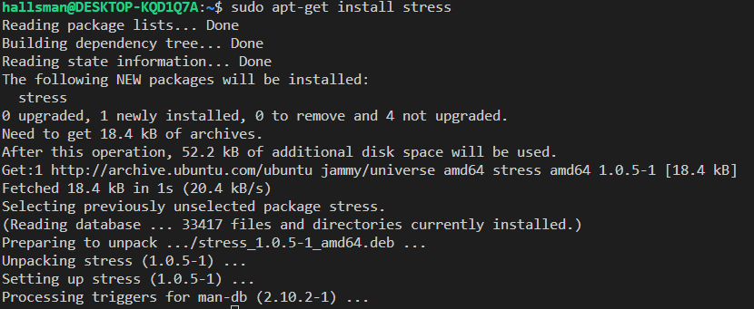
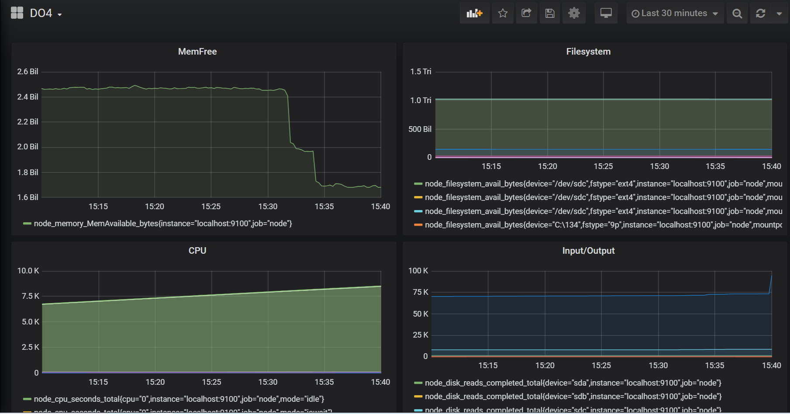

## Prometheus и Grafana

#### Установить и настроить Prometheus и Grafana на виртуальную машину

Устанавливаем Prometheus как в инстуркции оффициального сайта (https://prometheus.io/docs/prometheus/latest/getting_started/)

Для этого там же скачиваем тар файл и добавляем в общую с машиноый папку - затем запускаем установочник командой 'tar xvfz prometheus-*.tar.gz'

Дальше поинструкции, но можно просте через апт инсталл - просто версия пос тарше будет 

Настраиваем как на сайте конфиг файл в etc/prometheus/prometheus.yml

Проверяем статус

Скачиваем Node-Exporter для работы с метриками по инструкции офф сайта (https://prometheus.io/docs/guides/node-exporter/)

Приерно также как и прометеус скачиваем файл, добавляем в общую папку и т.д.

Вот тут подробнее (https://1cloud.ru/help/monitoring_system_helps/node_export_install_ubuntu_18/)

Устанавливаем Grafana : snap install grafana

Запускаем 

Проверяем статус

#### Получить доступ к веб интерфейсам Prometheus и Grafana с локальной машины

Проеметеус

Открываем в браузере страницу localhost:9090 или если в конфиге другой адрес, то его

Графана

Открываем в браузере страницу localhost:3000 

log: admin pass: admin

#### Добавить на дашборд Grafana отображение ЦПУ, доступной оперативной памяти, свободное место и кол-во операций ввода/вывода на жестком диске

Для этого необходимо пройти все шаги по настройке и испольовать готовые графики, для этого нужно будет зарегестрироватья, советую использовать VPN есть проблемы с доступом

Добавление источника данных (Data Source):

Войдите в веб-интерфейс Grafana (обычно по адресу http://<ваш_IP> или localhost:<ваш_порт>/).
В левом меню выберите "Configuration" (Настройка), а затем "Data Sources" (Источники данных).
Нажмите "Add your first data source" (Добавить первый источник данных) или кнопку "Add" (Добавить), если у вас уже есть другие источники данных.
Здесь вам нужно выбрать источник данных, который вы хотите добавить. Для мониторинга системы с помощью Node Exporter, вы можете использовать Prometheus. Введите следующую информацию:

Name: (Имя) Prometheus
Type: (Тип) Prometheus
HTTP URL: (HTTP-URL) http://localhost:9100
Оставьте все остальные настройки по умолчанию и нажмите "Save & Test" (Сохранить и проверить).

#### Запустить ваш bash-скрипт из Части 2

Посмотреть на нагрузку жесткого диска (место на диске и операции чтения/записи)

#### Установить утилиту stress и запустить команду stress -c 2 -i 1 -m 1 --vm-bytes 32M -t 10s

Посмотреть на нагрузку жесткого диска, оперативной памяти и ЦПУ

