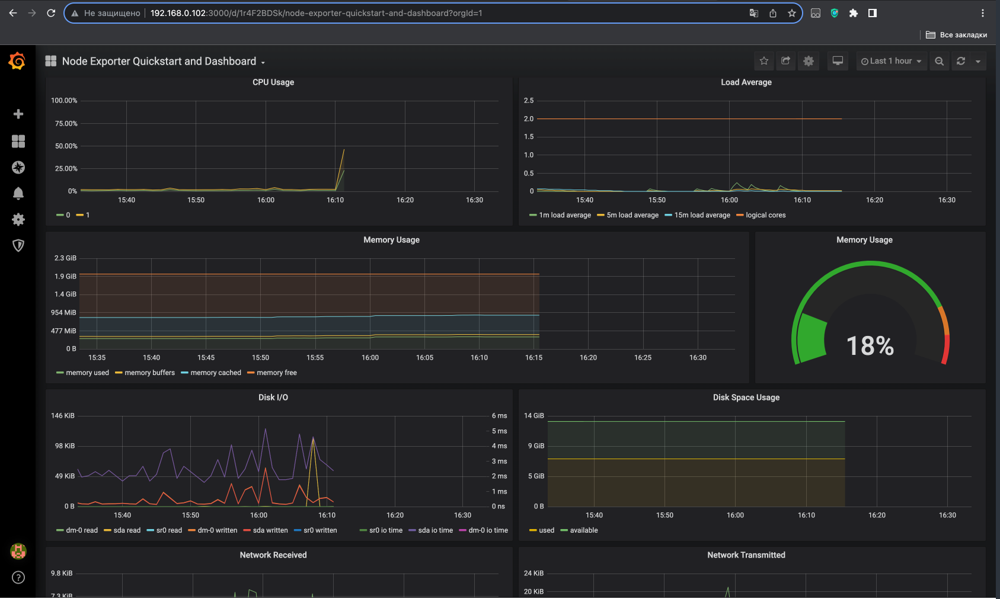
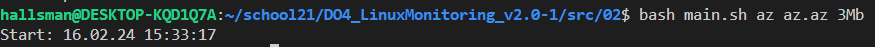
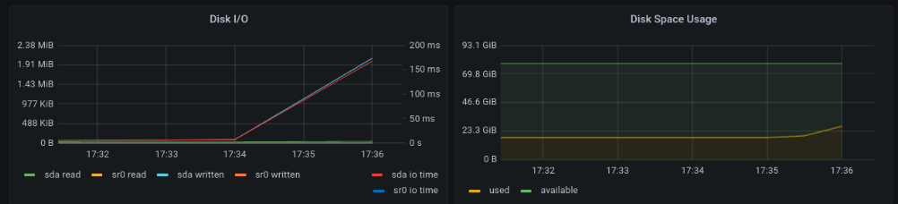
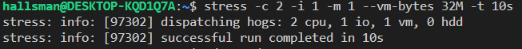
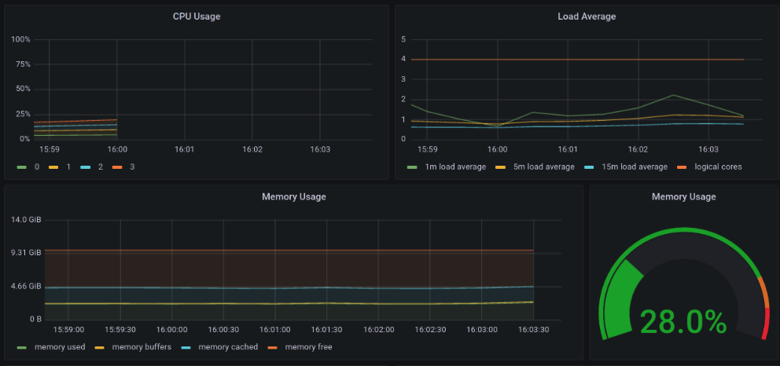
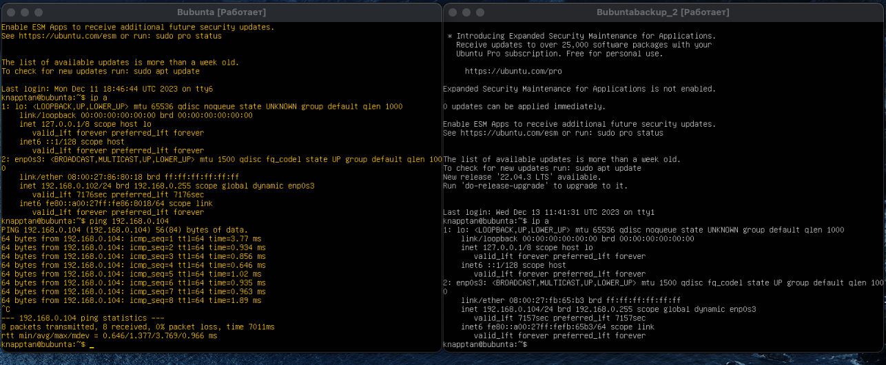
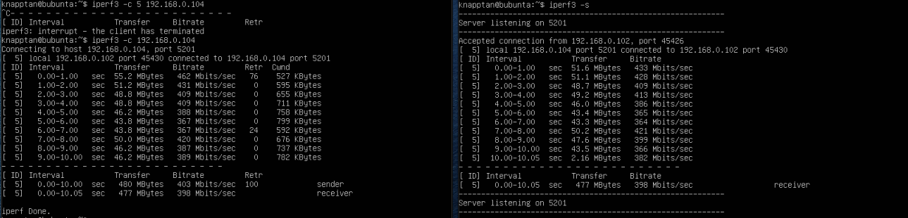
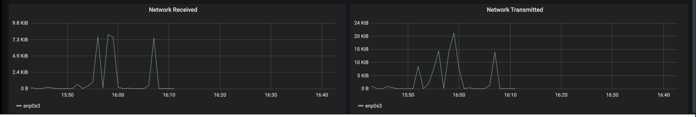

## Готовый дашборд

#### Установить готовый дашборд Node Exporter Quickstart and Dashboard с официального сайта Grafana Labs

В графическом интерфейсе есть ссылка на него, когда выбираешь добавить.

Вот описание шагов по добавлению:

Добавление источника данных (Data Source):

Войдите в веб-интерфейс Grafana (обычно по адресу http://<ваш_IP>:<ваш_порт>/).
В левом меню выберите "Configuration" (Настройка), а затем "Data Sources" (Источники данных).
Нажмите "Add your first data source" (Добавить первый источник данных) или кнопку "Add" (Добавить), если у вас уже есть другие источники данных.
Здесь вам нужно выбрать источник данных, который вы хотите добавить. Для мониторинга системы с помощью Node Exporter, вы можете использовать Prometheus. Введите следующую информацию:

Name: (Имя) Prometheus
Type: (Тип) Prometheus
HTTP URL: (HTTP-URL) http://<ваш_IP> или localhost:9090
Оставьте все остальные настройки по умолчанию и нажмите "Save & Test" (Сохранить и проверить).

Установка Dashboards для Node Exporter:

В левом меню выберите "➕" (плюс) и выберите "Import" (Импорт).
Введите ID дашборда для Node Exporter из официального репозитория Grafana: 13978.
Или же можно скпаировать его в Json формате
Нажмите "Load" (Загрузить).
В разделе "Prometheus" выберите предварительно настроенный источник данных Prometheus.
Нажмите "Import" (Импорт).

#### Провести те же тесты, что и в Части 7

Запустить ваш bash-скрипт из Части 2
Посмотреть на нагрузку жесткого диска

Запустить команду stress -c 2 -i 1 -m 1 --vm-bytes 32M -t 10s
Посмотреть на нагрузку жесткого диска, оперативной памяти и ЦПУ

Для удобства создания сети я использовал натсройки сети и сетевой мост через родительский вайфай адаптер

Это добавит виртаульные машины в мою домашнюю сеть однако изменит доступ к ним 

Теперь для доступа на страницу состояния я использую не (http://localhost:3000/) а адрес машины и псоле порт (http://192.168.0.102:3000/)

Также для доступа к метрикам (http://192.168.0.102:9100/metrics) или к прометеус (http://192.168.0.102:9090/)

Но настройки графаны остаютс с локалхост так как графана и преметеус на одной машине

#### Запустить ещё одну виртуальную машину, находящуюся в одной сети с текущей

 

#### Запустить тест нагрузки сети с помощью утилиты iperf3

#### Посмотреть на нагрузку сетевого интерфейса

