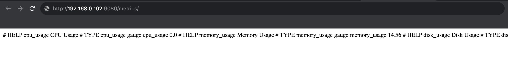
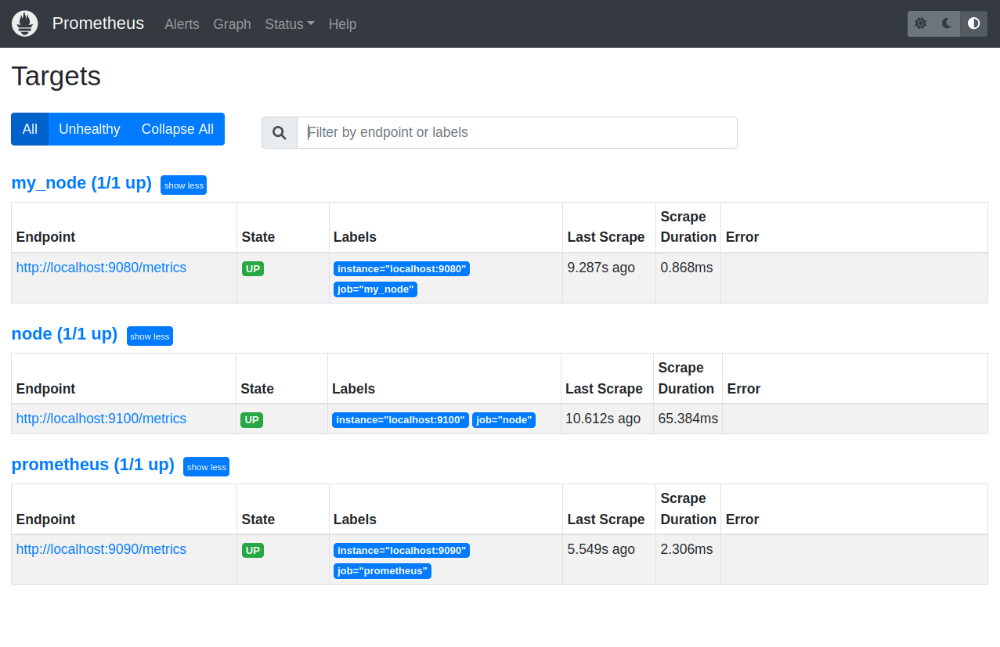
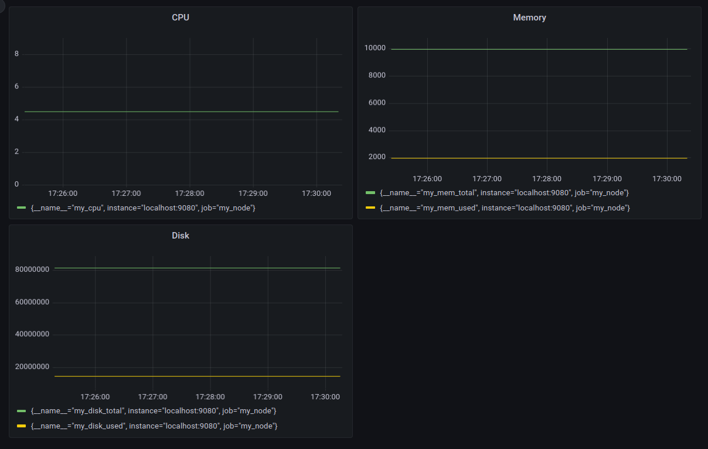
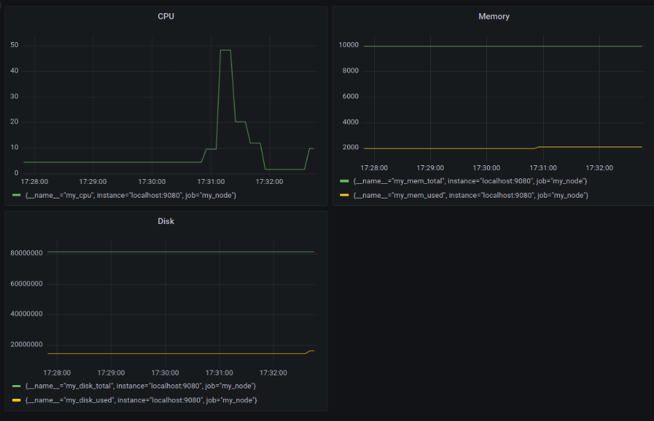
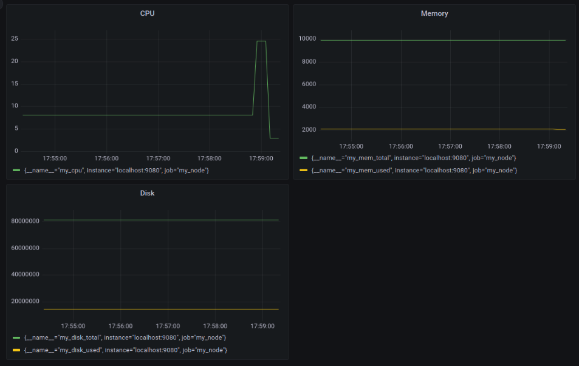

## Дополнительно. Свой node_exporter

Написал bash-скрипт, который собирает информацию по базовым метрикам системы (ЦПУ, оперативная память, жесткий диск (объем)).

./main.sh для запуска

my_node_exporter.sh собирает информацию по базовым метрикам системы 

Он будет выполняться в бесконечном цикле, обновляя метрики каждые 5 секунд 

Все метрики зыписываются в HTML-страницу 

#### Скрипт или программа должна формировать html страничку по формату Prometheus, которую будет отдавать nginx.

Настраиваю конфигурационный файл nginx.

Файл есть в папке.

Проверяю работает ли nginx на порту 9080

Саму страничку обновлять можно как внутри bash-скрипта или программы (в цикле), так и при помощи утилиты cron, но не чаще, чем раз в 3 секунды.

Скрипт сам обновляется раз в 5 секунд по этому в конфигурации 

#### Поменять конфигурационный файл Prometheus, чтобы он собирал информацию с созданной вами странички.

Настраиваю yml файл promethus

Файл есть в папке 

Проверяю prometheus на порту 9090

Создаю таблицы для проверки метрик

#### Провести те же тесты, что и в Части 7

Запустить ваш bash-скрипт из Части 2

Посмотреть на нагрузку жесткого диска

Запустить команду stress -c 2 -i 1 -m 1 --vm-bytes 32M -t 10s

Посмотреть на нагрузку жесткого диска, оперативной памяти и ЦПУ

