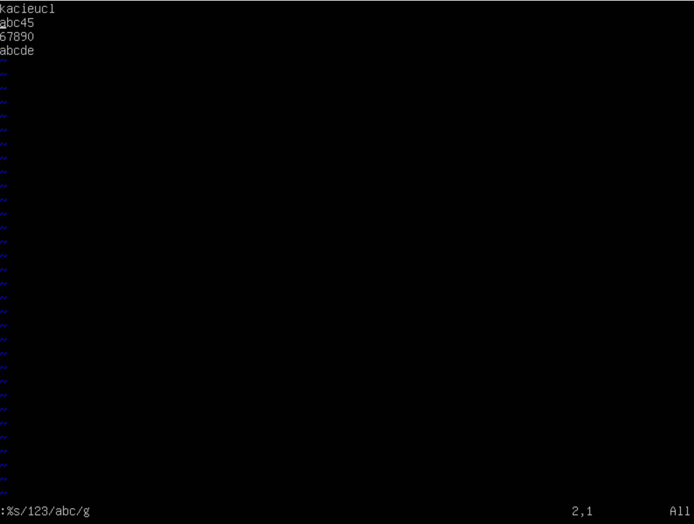
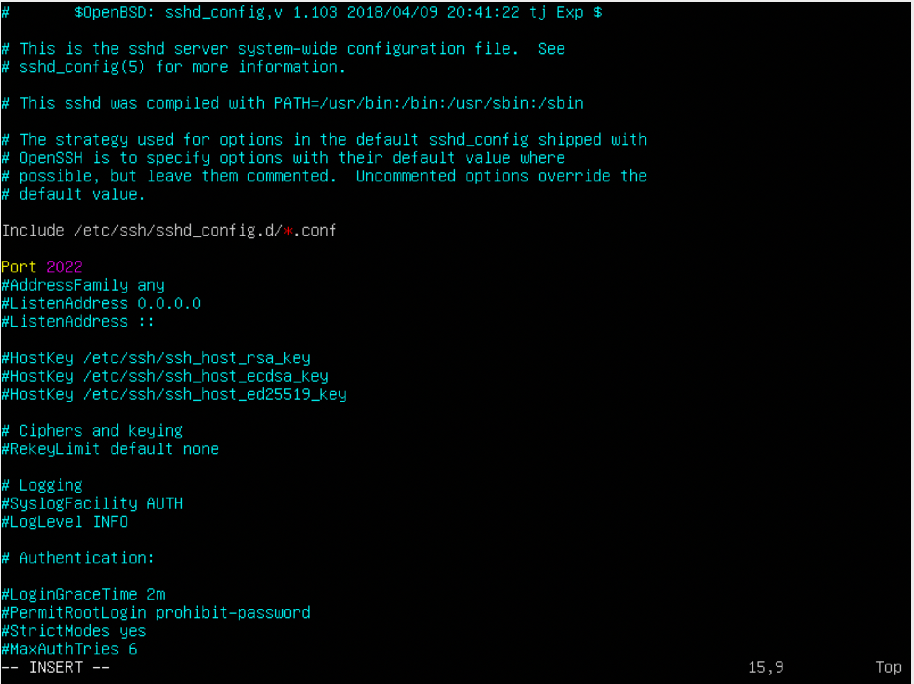

## Part 1. Установка ОС

Вызов команды, чтобы узнать версию Ubuntu:
* cat /etc/issue

## Part 2. Создание пользователя

Вызов команды для создания пользователя с добавлением в группу adm:

Вывод команды с новым пользователем:
* cat /etc/passwd

## Part 3. Настройка сети ОС

Задать название машины вида user-1:

Установить временную зону, соответствующую вашему текущему местоположению, через команду sudo timedatectl set-timezone:

Вывод названия сетевых интерфейсов:

* lo – интерфейс локальной петли, который служит для подключения по сети к этому же компьютеру (127.0.0.1), он не требует дополнительной настройки. Виртуальный интерфейс, присутствующий по умолчанию в любом Linux. Используется для отладки сетевых программ и запуска серверных приложений на локальной машине.

Получение ip адреса устройства:

Протокол динамической конфигурации хоста (DHCP) — это клиент-серверный протокол, который автоматически предоставляет хосту Интернет-протокола (IP) его IP-адрес и другую связанную информацию о конфигурации, такую как маска подсети и шлюз по умолчанию.

Внутренний (локальный) IP — это IP-адрес, который выдается компьютеру в пределах внутренней локальной сети. Такой адрес не используется для выхода в сеть.

Внешний IP-адрес вы получаете от вашего провайдера. Он может быть статическим и динамическим (меняется каждый раз когда вы подключаетесь к сети). Уникальный адрес, под которым компьютер виден прочим устройствам в глобальной сети.

Внешний ip-адрес шлюза (ip) и внутренний IP-адрес шлюза, он же ip-адрес по умолчанию (gw):
  * внутренний
  
  * внешний
  

  Задать статичные настройки ip, gw, dns:
  sudo vim /etc/netplan/00-installer-config.yaml
  
  * в dhcp4: true меняем на no
  * добавляем addresses: наш внутренний ip
  * добавляем gateway4: 10.0.2.2
  * nameservers:
          addresses: [1.1.1.1, 8.8.8.8]
  

  sudo netplan apply - применить настройки.
  sudo reboot - перезагрузить.

* Пропинговать удаленные хосты 1.1.1.1 и ya.ru:

## Part 4. Обновление ОС
* sudo apt-get upgrade

## Part 5. Использование команды sudo

sudo - даёт пользователю права администратора, которые обычно доступны для пользователя root.

* Права новому пользователю на sudo:
sudo usermod -a -G sudo macmac
* Переключиться на пользователя:
sudo su - macmac
* Изменить hostname:
sudo hostnamectl set-hostname new

## Part 6. Установка и настройка службы времени

* Синхронизация времени:

## Part 7. Установка и использование текстовых редакторов
1.
* VIM
Выход с сохранением из vim - esc, :wq, Enter.

* NANO
Выход с сохранением из nano - Ctrl + S (сохранить файл), Ctrl+X (выйти из файла).

* JOE
Выход с сохранением из joe - Ctrl + K X.

2.
* VIM
Выход без сохранения из vim - :q!, Enter.

* NANO
Выход без сохранения из nano - Ctrl + X, выбрать N.

*JOE
Выход без сохранения из joe - Ctrl + C, выбрать y.

3.
* VIM
Поиск в vim - / <текст> Enter, ? <текст> Enter (ищет с конца).

Замена в vim - :substitute:
:%s/<искомый текст>/<текст замены>/g (для замены всех найденных вхождений)

* NANO
Поиск в nano - Ctrl + W <текст> Enter.

Замена в nano - Ctrl + \\

* JOE
Поиск в joe - Ctrl + K F <текст> Enter.

Замена в joe - Ctrl + K F <искомый текст>, R <текст замены>, Y

## Part 8. Установка и базовая настройка сервиса SSHD

SSH (Secure Shell) — сетевой протокол прикладного уровня, который позволяет управлять операционной системой и выполнять функцию тунеллирования TCP-соединения. Работа SSH построена на взаимодействии 2-х компонентов: SSH-сервера и SSH-клиента. SSH-сервер по умолчанию прослушивает соединения на порту 22, а также требует аутентификации сторон.
sshd - это служба, принимающая запросы на соединения от клиентов.

* Установка - sudo apt-get install ssh, sudo apt install openssh-server.
* Автостарт - sudo systemctl enable ssh.
* sudo vim /etc/ssh/sshd_config (порт 2022)

Команда ps выводит список текущих процессов на сервере в виде таблицы, с которой можно удобно работать: сортировать, изменять количество колонок и прочие.

* Команды ps выбора процессов для отображения:
-A, -e, (a) - выбрать все процессы;
-u, (U) - выбрать процессы пользователя.

* Вывод команды netstat -tan.

-t | --tcp показывает только tcp сокеты.
-n | --numeric показывает номерные адреса, вместо символических хостов, портов или юзеров.
-а | --all показывает все подключения, как ожидающие, так и не ожидающие подключения сокеты.  

Столбцы показывают информацию:
- Proto - протокол, используемый сокетом (tcp, udp, raw);
- Recv-Q - количество байтов, не скопированных пользовательской программой, подключенной к этому сокету;
- Send-Q - количество байтов, не подтвержденных удаленным хостом;
- Local Address - адрес и номер порта локального конца сокета;
- Foreign Address - адрес и номер порта удаленного конца сокета;
- State - состояние сокета     
0.0.0.0 в качестве foreign address означает, что никто не подсоединен к данному сокету.

## Part 9. Установка и использование утилит top, htop

Утилита top - объем занятой памяти вместе с кэш.
Утилита htop - объём реально занятой памяти без кэша.

* uptime (up) - 1ч 19мин;
* Количество авторизованных пользователей - 1;
* Общая загрузка системы (load average) - 0.00
* Общее количество процессов (total) - 104;
* Загрузка cpu: us = 0.0 (процент использования центрального процессора пользовательскими процессами);
  sy = 0.0 (процент использования центрального процессора системными процессами);
  ni = 0.0 (процент использования центрального процессора процессами с приоритетом, повышенным при помощи вызова);
  id = 100.0 (процент времени, когда центральный процессор не используется);
  wa = 0.0 (процент использования центрального процессора процессами, ожидающими завершения операций ввода-вывода);
  hi = 0.0 (Hardware IRQ (аппаратные прерывания) — процент использования центрального процессора обработчиками аппаратных прерываний);
  si = 0.0 (Software Interrupts (программные прерывания) — процент использования центрального процессора обработчиками программных прерываний);
  st = 0.0 (Steal Time (заимствованное время) — количество ресурсов центрального процессора "заимствованных" у виртуальной машины гипервизором для других задач (таких, как запуск другой виртуальной машины); это значение будет равно нулю на настольных компьютерах и серверах, не использующих виртуальные машины);
* Загрузка памяти - 166.8;
* systemd использует больше всего памяти и больше всего процессорного времени.

Сортировка htop:
* по PID

* по PERCENT_CPU

* по PERCENT_MEM

* по TIME

* Фильтр для процесса sshd:
 

* Процесс syslog:

с добавленным выводом hostname, clock и uptime:

## Part 10. Использование утилиты fdisk

Использование утилиты fdisk -l:  

  * Название жесткого диска: /dev/sda  
  * Размер:  10737418240 bytes  
  * Количество секторов: 20971520 
  * Размер swap: 1.3G

## Part 11. Использование утилиты df

Команда df (данные в килобайтах):
* размер раздела - 8408452 Kб
* размер занятого пространства - 4087140 Кб
* размер свободного пространства - 3872596 Кб
* процент использования - 52%

Команда df -Th:
* размер раздела - 8.1G
* размер занятого пространства - 3.9G
* размер свободного пространства - 3.7G
* процент использования - 52%
Тип файловой системы - ext4.

## Part 12. Использование утилиты du

Размер папок /home, /var, /var/log в байтах:

Размер всего содержимого в /var/log.*

## Part 13. Установка и использование утилиты ncdu

/home

/var

/var/log

## Part 14. Работа с системными журналами

Время последней успешной авторизации - Wed Jun 18:04
Имя пользователя - kacieucl
Метод входа в систему - tty1

Рестарт:

## Part 15. Использование планировщика заданий CRON

