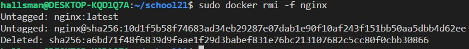
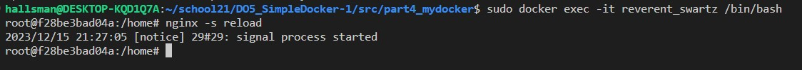

# S21_SimpleDocker

## Part1. Ready-made docker

* Возьмемо официальный docker-образ с nginx и выкачаем его при помощи команды `docker pull` 


* Далее удостоверимся в наличии образа через команду `docker images` 


* Наконец, запустим docker-образ через команду `docker run -d [image_id|repository]` 

```
-d: это флаг, который указывает Docker на запуск контейнера в фоновом режиме (detached mode). Это означает, что контейнер будет работать в фоновом режиме, и командная строка будет освобождена для дальнейшего использования.
```

* Удостоверимся, что контейнер успешно запустился через команду `docker ps` 


* Теперь посмотрим информацию о контейнере через команду `docker inspect [container_id|container_name]` 


* Выведем размер контейнера  


* А теперь - список замапленных портов  


* И, наконец, IP контейнера  


* Остановим docker-образ командой `docker stop [container_id|container_name]` и проверим, что образ успешно остановился через команду `docker ps` 


* Теперь запустим docker-образ с портами 80:80 и 443:443 через команду `docker run` 


* Удостоверимся, что все работает, открыв в браузере страницу по адресу `localhost` 


* Наконец, перезапустим контейнер через команду `docker restart [container_id|container_name]` и проверим, что контейнер снова запустился командой `docker ps` 


# Part2. Operations with container

* Для начала прочтем конфигурационный файл `nginx.conf` внутри docker-контейнера через команду `docker exec` 


* Теперь создадим локальный файл `nginx.conf` при помощи команды `touch nginx.conf` и настроем в нем выдачу страницы-статуса сервера по пути `/status` 


* Наконец, перенесем созданный файл внутрь docker-образа командой `docker cp` 


* И перезапустим nginx внутри docker-образа командой `docker exec [container_id|container_name] nginx -s reload` 


* Убедимся, что все работает, проверив страницу по адресу `localhost/status` 


* Теперь экспортируем наш контейнер в файл `container.tar` командой `docker export` 


* Затем удалим образ командой `docker rmi -f [image_id|repository]`, не удаляя перед этим контейнеры 


* После чего удалим остановленный контейнер командой `docker rm [container_id|container_name]` 


* Теперь импортируем контейнер обратно командой `docker import` и запустим импортированный контейнер уже знакомой командой `dicker run` 


* Наконец проверим, что по адресу `localhost/status` выдается страничка со статусом сервера nginx 


## Part3. Mini web server

* Чтобы создать свой мини веб-сервер, необходимо создать .c файл, в котором будет описана логика сервера (в нашем случае - вывод сообщения `Hello World!`), а также конфиг `nginx.conf`, который будет проксировать все запросы с порта 81 на порт 127.0.0.1:8080 
 


* Теперь выкачаем новый docker-образ и на его основе запустим новый контейнер 


* После перекинем конфиг и логику сервера в новый контейнер 


* Затем установим требуемые утилиты для запуска мини веб-сервера на FastCGI, в частности `spawn-fcgi` и `libfcgi-dev` 


* Наконец скомпилируем и запустим наш мини веб-сервер через команду `spawn-fcgi` на порту 8080 


* Чтобы удостовериться, что все работает корректно, проверим, что в браузере по адресу `localhost:81` отдается написанная нами страница 


## Part4. Your own docker

* Напишем свой docker-образ, который собирает исходники 3-й части, запускает на порту `80`, после копирует внутрь написанный нами `nginx.conf` и, наконец, запускает `nginx` (ниже приведены файлы `run.sh` и `Dockerfile`, файлы `nginx.conf` и `server.c` остаются с 3-й части)

  
  

* Соберем написанный docker-образ через команду `docker build`, при этом указав имя и тэг нашего контейнера  
  

* Теперь удостоверимся, что все собралось, проверив наличие соответствующего образа командой `docker images`  
  

* После запустим собранный docker-образ с мапингом порта `81` на порт `80` локальной машины, а также мапингом папки `./nginx` внутрь контейнера по адресу конфигурационных файлов nginx'а, и проверим, что страничка написанного сервера по адресу 


```
!!Примечание!!
Если при проверке адреса localhost вы увидете ошибку 502, остановите запущенный docker-образ, после исправьте ошибки в конфигурационных файлах и заново запустите собранный docker-образ
```

* Теперь добавим в файл `nginx.conf` проксирование странички `/status`, по которой необходимо отдавать статус сервера `nginx  


* Теперь перезапустим `nginx` в своем docker-образе командой `nginx -s reload`  


* Наконец, проверим, что по адресу `localhost/status` выдается страничка со тсатусом сервера `nginx`  


## Part5. Dockle

```
!!Примечание!!
Перед выполнением данного шага необходимо установить утилиту [dockle], инструкция по установке [https://github.com/goodwithtech/dockle], если машина не видит утилиту [https://github.com/aquasecurity/trivy/issues/2432], также рекомендую добавить своего пользователя в группу [docker]
```

* сперва установим dockle  
  

* потом проверим образ  
  

* переписываем докерфайл  
  

* Ошибки устранены
  

## Part6. Basic Docker Compose

```
!!Примечание!!
Перед выполнением данного шага необходимо установить утилиту [docker-compose], инструкция по установке [https://www.digitalocean.com/community/tutorials/how-to-install-and-use-docker-compose-on-ubuntu-20-04]
```

* Для начала остановим все запущенные контейнеры командой `docker stop`  


* Перепишем скрипт run для второго контейнера


* Перепишем _**nginx.conf**_ для проксирования  
 

* напишем **_docker-compose.yml_**  
  

* Теперь сбилдим контейнер командой `docker-compose build`
  

* После необходимо поднять сбилженный контейнер командой `docker compose up`
 

* проверяем в браузере

 
  
